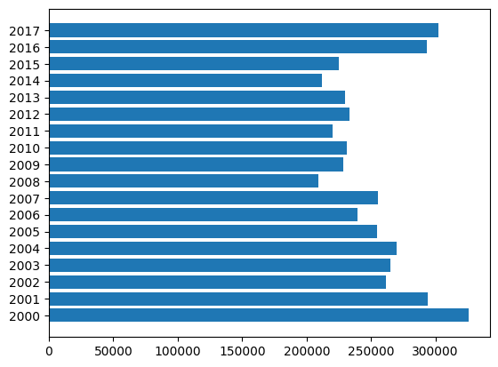
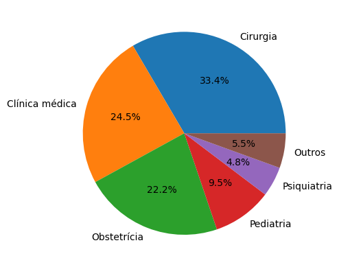
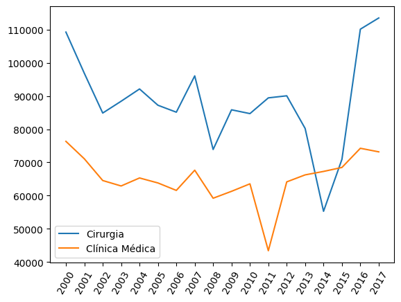
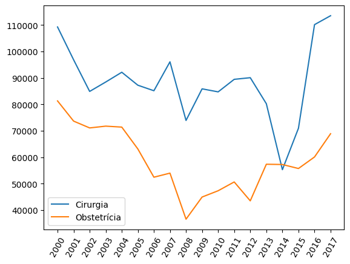

# Internações SUS RJ
Este estudo tem por objetivo mostrar que no período que precedeu a Copa do Mundo de 2014 e os Jogos Olímpicos de 2016, o número de internações para cirurgias reduziu e logo após os eventos citados voltou a subir.

Os dados foram obtidos no site oficial de dados do RJ.

## Estudo de caso
As cirurgias na rede hospitalar carioca representam mais de 55% do número de internações, desse total, cerca de 22% são motivadas por obstetrícia (partos) e 33% por cirurgia geral.

Logo se vê que a necessidade de bons aparelhos se faz necessária na rede pública de hospitais, principalmente a quantidade de leitos.

Como podemos ver, o número de internações veio diminuíndo no decorrer dos anos, mas algo curioso apareceu ao acompanharmos a especialidade **cirurgia** no decorrer dos anos.

Nos dois anos anteriores a Copa do Mundo, houve uma queda considerável no número de internações. Na época houveram muitas manifestações a respeito e alguns discursos um tanto infelizes, mas uma das provas está aí.

Não podemos nos iludir achando que os problemas foram resolvidos nesse período, mas está claro que durante estes anos houveram fatos que fizeram com que caíssem esses números e justamente após o período dos eventos, os números voltassem a subir.

Os causadores disso já imaginamos, mas isso é Brasil...